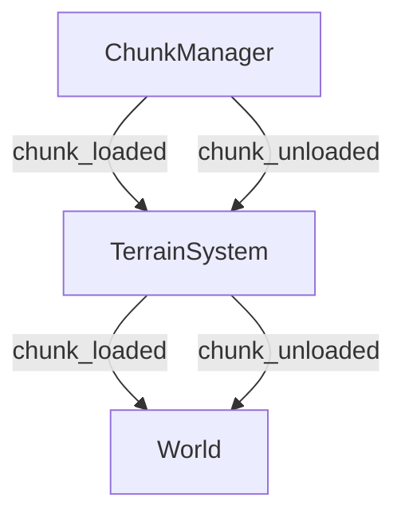
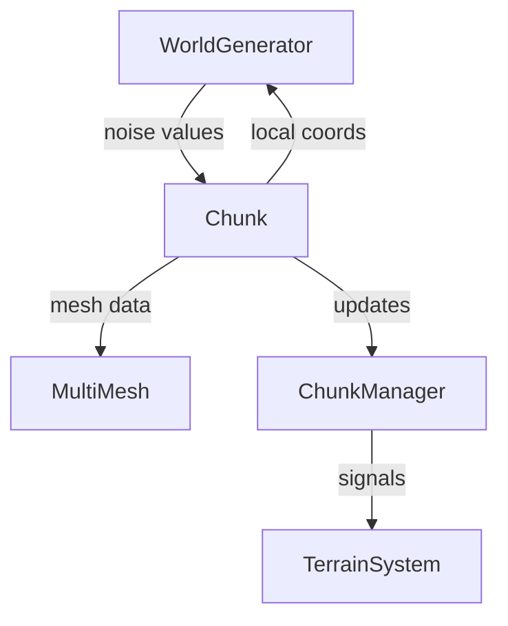
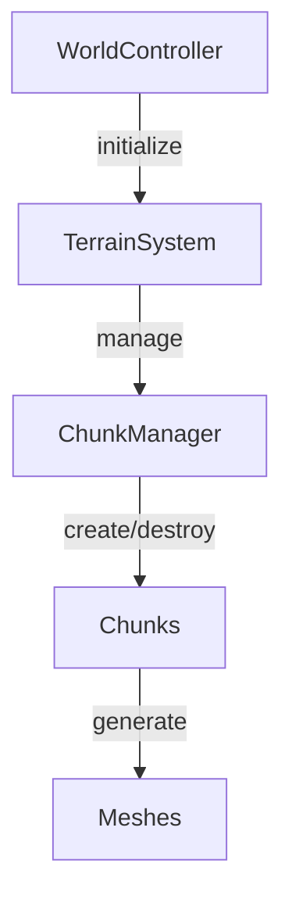
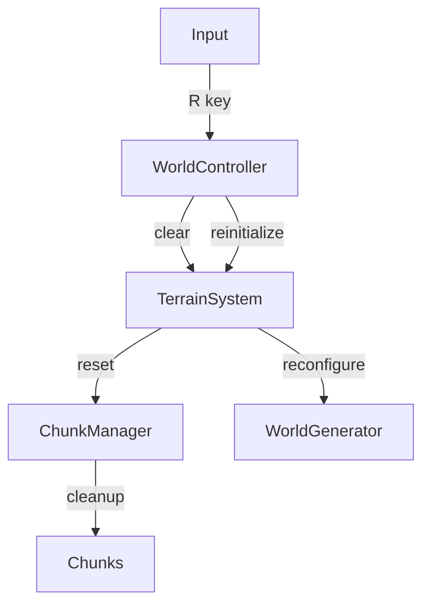

# System Patterns

## Core Architecture

### Node Hierarchy
```
World (Node3D)
├── TerrainSystem (Node3D)
│   ├── ChunkManager (Node3D)
│   │   └── Chunks (Node3D instances)
│   └── WorldGenerator (Node)
├── LightingSystem (Node3D)
├── Player (Node3D)
└── HUD (Control)
```

### Signal Flow


## Core Systems

### Settings Management
- Centralized configuration through `GameSettings` resource
- Global access via autoloaded `SettingsManager`
- Default fallback values for error resilience
- Runtime configuration updates

### Terrain Generation


#### Noise Layers
1. Base Terrain
   - Primary heightmap generation
   - Medium frequency for general terrain shape

2. Mountain Layer
   - Lower frequency for large-scale features
   - Higher amplitude for elevation variation

3. Detail Layer
   - Higher frequency for surface variation
   - Lower amplitude for subtle details

4. Cave Layer
   - High frequency for varied cave shapes
   - Threshold-based cavity generation

### World Management

#### Chunk System


#### Coordinate Systems
1. World Space
   - Global coordinates
   - Used for player position
   - Continuous float values

2. Chunk Space
   - Discrete chunk positions
   - Integer-based coordinates
   - Used for chunk management

3. Local Space
   - Coordinates within chunks
   - Range: 0 to chunk_size-1
   - Used for voxel placement

#### World Regeneration


### Voxel Management

#### Voxel Data
- Array-based storage
- Index calculation: `x + (y * size² ) + (z * size)`
- Binary state (solid/air)
- Future extensible for block types

#### Mesh Generation
- Wireframe cube representation
- MultiMesh for instance batching
- Transform-based positioning
- White unshaded material

## Error Handling Patterns
1. Node Reference Validation
   ```gdscript
   if !node:
       push_error("Node not found!")
       return
   ```

2. Settings Fallbacks
   ```gdscript
   var value = settings_manager.get_value() if settings_manager else default_value
   ```

3. Signal Management
   ```gdscript
   if signal.is_connected(callable):
       signal.disconnect(callable)
   signal.connect(callable)
   ```

## Preservation Guidelines

### Code Structure
- Clear system separation
- Node-based architecture
- Signal-driven communication
- Error-resilient design

### Performance Considerations
- Chunk-based loading
- Instance batching
- Coordinate system optimizations
- Signal-based updates

### Maintainability
- Centralized settings
- Clear error reporting
- Modular systems
- Documented patterns