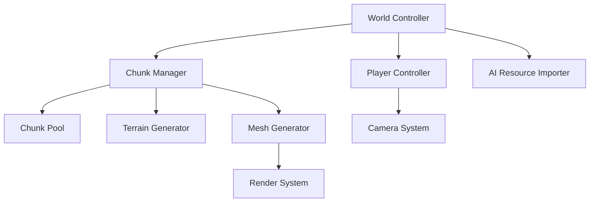
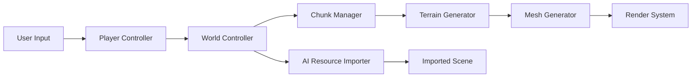

# System Patterns

## Core Architecture

### Component Overview

## Key Systems

### World Management
1. World Controller
   - Coordinates all subsystems
   - Manages game state
   - Handles player interaction

2. Chunk System
   - Chunk Manager:
     - Tracks active chunks
     - Handles chunk loading/unloading
     - Maintains chunk cache
   - Chunk Data:
     - Voxel data storage
     - Modification history
     - Chunk state management

### Terrain Generation
1. Noise Generator
   - Perlin noise implementation
   - Height map generation
   - Biome parameters (future)

2. Mesh Generation
   - Greedy meshing algorithm
   - Face culling optimization
   - Vertex/index buffer management

### Player Systems
1. Camera Controller
   - Input handling
   - Movement physics
   - Ray casting for editing

2. Interaction System
   - Voxel selection
   - Modification tools
   - Collision detection

### AI Resource Import
1. AI Resource Importer
   - Imports scenes and tilemaps from JSON
   - Integrates AI-generated content
   - Configurable import paths

## Design Patterns

### Singleton Patterns
- World Controller
- Chunk Manager
- Resource Manager
- AI Resource Importer

### Observer Pattern
- Chunk update notifications
- Player position tracking
- Terrain modification events

### Object Pooling
- Chunk data structures
- Mesh instances
- Collision shapes

### Command Pattern
- Terrain modifications
- Player actions
- Potential undo/redo system

## Data Flow

## Optimization Strategies
1. Chunk Loading
   - Priority-based loading queue
   - Distance-based unloading
   - Chunk data compression

2. Rendering
   - View frustum culling
   - Occlusion culling
   - Mesh combining

3. Memory Management
   - Chunk data pooling
   - Mesh data reuse
   - Resource caching